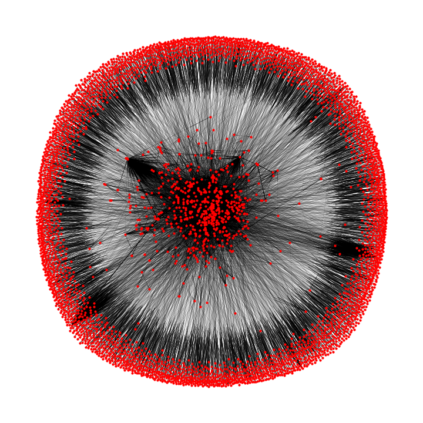

# link_embedding [Work in progress]

## Introduction
Embedding link connections from a webcrawler

This is a work in process. What happens if we try to create vector embeddings based on a graph where nodes are websites and edges are links?

First we will use a webcrawler to map out a tiny portion of the internet as data. We construct a directed graph from the link connections. 

## Graph Construction
To reduce the size of the graph, I construct the graph of domains as opposed to urls. I define the domain of an url according to tldextract as: 

```
import tldextract
output = tldextract.extract(url-string)
domain = output.domain    
```
thus it is possible to merge together various section of a url into a single domain (i.e. corporate.website.com and investor.website.com).

In the resultant graph nodes represents domains and edges connections between domains, as opposed to direct urls. This dramatically reduces the number of nodes I have to represent. A visualization of the directed graph can be seen below. 

<p align="center">

</p>

## Vector Embedding

We use the idea behind [arXiv:1403.6652 [cs.SI]](https://arxiv.org/abs/1403.6652) and take a random walk about nodes in the graph. The length of the walk represents the target and context window data for which we will embed in vector space.

It is important to take care here, as the link connections form a directed graph, is not in fact possible to walk from every node (as it would be in an undirected graph as in the original DeepWalk paper). Certain nodes in the graph will be terminal. Therefore, the set of "walkable" nodes is a fraction of all the nodes.

We construct a standard vector embedding analogous to word2vec in Tensorflow, the full code is as shown in `graph_embedding.ipynb`. The resultant vectors tell us the similarity between the items. 

In this case we would expect the similarity to be defined as how similar two domains are based on the connections between them. We can construct a full similarity matrix to look at this. 

## Results

In the table below, I output a few examples showing the embedding can reasonably capture the local similarity amongst nodes.

Source Node| Node 1| Score 1|Node 2 | Score 2|Node 3| Score 3| 
---|--- |---|--- |---|--- |---|
'facebook'|'twitter'|0.23|'linkedin'|0.66|'instagram'|0.72
'usanetworkstore'|'cnbcstore'|0.38|'nbcstore'|0.41|'msnbcstore'|0.48
'sciencechannel'|'tlc'|0.41|'velocity'|0.48|'destinationamerica'|0.49

It is clear the vector embedding can group together similar domains by their connections. The score represents the angle between their embedded vectors.

## To do list

  - Clean up documentation on web crawler script.
  - Perform visualization on embedding
  - <s>Merge variations of a single domain into one node</s>
  - Crawl for more connections
