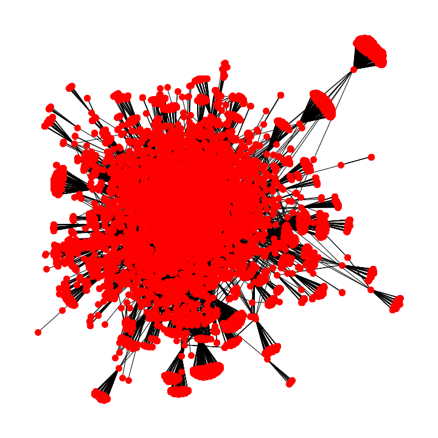

# link_embedding
Embedding link connections from a webcrawler

This is a work in process. What happens if we try to create vector embeddings based on a graph where nodes are websites and edges are links?

First we will use a webcrawler to map out a tiny portion of the internet as data. We construct an undirected graph from the link connections. 

To reduce the size of the graph, I construct the graph of domains as opposed to urls. Thus nodes represents domains and edges connections between domains, as opposed to direct urls. A visualization of this can be seen below.

We use the idea behind [arXiv:1403.6652 [cs.SI]](https://arxiv.org/abs/1403.6652) and take a random walk about each node in the graph. The length of the walk represents the target and context window data for which we will embed in vector space.

We construct a standard vector embedding analogous to word2vec in Tensorflow, the full code is as shown in `graph_embedding.ipynb`. The resultant vectors tell us the similarity between the items. 

In this case we would expect the similarity to be defined as how similar to domains are based on the connections between them. We can construct a full similarity matrix to look at this.
